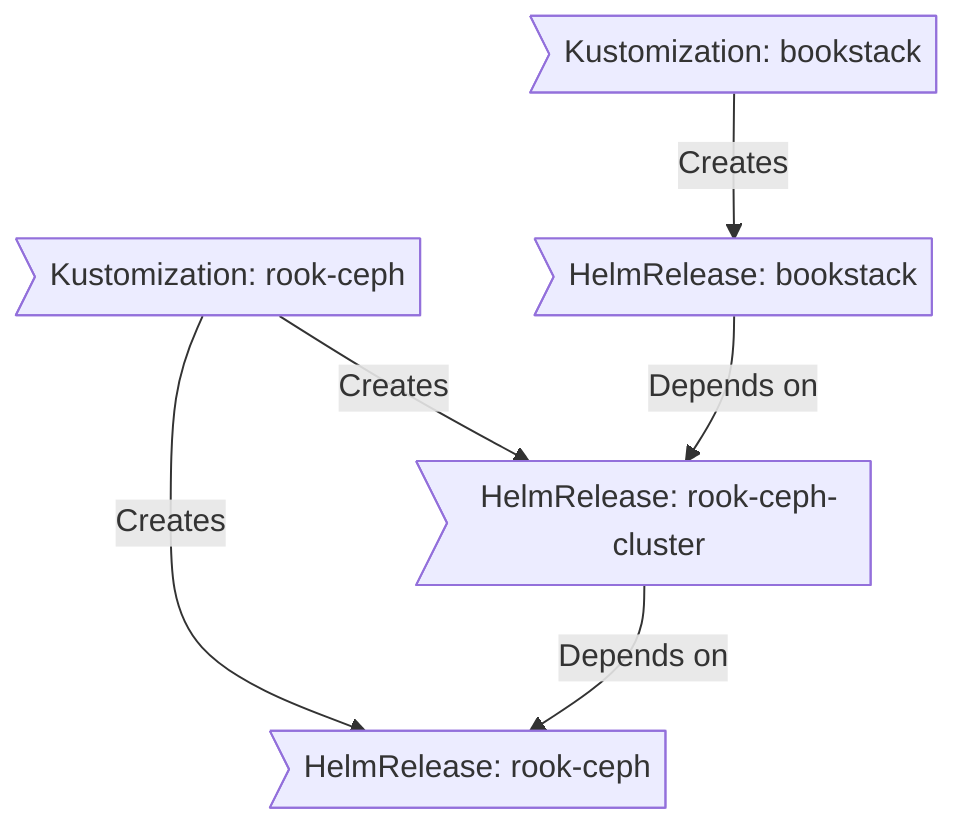

<div align="center">


### My Home Operations repository :octocat:

_... managed with Flux, Renovate and GitHub Actions_ 🤖


</div>

<div align="center">

[](https://discord.gg/k8s-at-home)&nbsp;&nbsp;
[](https://www.talos.dev/)&nbsp;&nbsp;
[](https://www.talos.dev/)&nbsp;&nbsp;
[](https://fluxcd.io)\
[](https://github.com/smbonn2005/HomeOps/commits/main 'Commit History')&nbsp;&nbsp;
[](https://github.com/smbonn2005/HomeOps/stargazers 'This repo star count')&nbsp;&nbsp;
[](https://github.com/smbonn2005/HomeOps/actions/workflows/renovate.yaml)

</div>

<div align="center">

[](https://github.com/kashalls/kromgo/)&nbsp;&nbsp;
[](https://github.com/kashalls/kromgo/)&nbsp;&nbsp;
[](https://github.com/kashalls/kromgo/)&nbsp;&nbsp;
[](https://github.com/kashalls/kromgo/)&nbsp;&nbsp;
[](https://github.com/kashalls/kromgo/)&nbsp;&nbsp;
[](https://github.com/kashalls/kromgo/)&nbsp;&nbsp;
[](https://github.com/kashalls/kromgo/)&nbsp;&nbsp;
[](https://github.com/kashalls/kromgo)

</div>

---

## 📖 Overview

This is a mono repository for my home infrastructure and Kubernetes cluster. I try to adhere to Infrastructure as Code (IaC) and GitOps practices using the tools like [FluxCD](https://github.com/fluxcd/flux2), [Renovate](https://github.com/renovatebot/renovate), [Kubernetes](https://kubernetes.io/),  and [GitHub Actions](https://github.com/features/actions).

---

## ⛵ Kubernetes

There is a template over at [onedr0p/flux-cluster-template](https://github.com/onedr0p/flux-cluster-template) if you wanted to try and follow along with some of the practices I use here.

### Installation

My Kubernetes cluster is deployed with [Talos](https://www.talos.dev/). This is a semi hyper-converged cluster, workloads and block storage are sharing the same available resources on my nodes while I have a separate server for (NFS) file storage.

### Core Components

<!-- - [actions-runner-controller](https://github.com/actions/actions-runner-controller): Self-hosted Github runners. -->
- [cert-manager](https://cert-manager.io/docs/): Creates SSL certificates for services in my Kubernetes cluster.
- [cilium](https://cilium.io/): Internal Kubernetes networking plugin.
- [cloudflared](https://github.com/cloudflare/cloudflared): Enables Cloudflare secure access to certain ingresses.
- [external-dns](https://github.com/kubernetes-sigs/external-dns): Automatically manages DNS records from my cluster in a cloud DNS provider.
- [external-secrets](https://github.com/external-secrets/external-secrets/): Managed Kubernetes secrets using [1Password Connect](https://github.com/1Password/connect).
- [ingress-nginx](https://github.com/kubernetes/ingress-nginx/): Ingress controller to expose HTTP traffic to pods over DNS.
- [rook-ceph](https://github.com/rook/rook): Distributed block storage for peristent storage.
- [sops](https://github.com/getsops/sops): Managed secrets for Kubernetes which are committed to Git.
- [spegel](https://github.com/spegel-org/spegel): Stateless cluster local OCI registry mirror.
- [volsync](https://github.com/backube/volsync): Backup and recover of persistent volume claims.

### GitOps

[Flux](https://github.com/fluxcd/flux2) watches my [kubernetes](./kubernetes/) folder (see Directories below) and makes the changes to my cluster based on the YAML manifests.

The way Flux works for me here is it will recursively search the [kubernetes/apps](./kubernetes/apps) folder until it finds the most top level `kustomization.yaml` per directory and then apply all the resources listed in it. That aforementioned `kustomization.yaml` will generally only have a namespace resource and one or many Flux kustomizations. Those Flux kustomizations will generally have a `HelmRelease` or other resources related to the application underneath it which will be applied.

[Renovate](https://github.com/renovatebot/renovate) watches my **entire** repository looking for dependency updates, when they are found a PR is automatically created. When some PRs are merged [Flux](https://github.com/fluxcd/flux2) applies the changes to my cluster.

### Directories

This Git repository contains the following directories under [kubernetes](./kubernetes/).

```sh
📁 kubernetes      # Kubernetes cluster defined as code
├─📁 bootstrap     # Cluster bootstrap procedures
├─📁 flux          # Flux System configuration plus re-usable components
└─📁 apps          # Apps deployed into my cluster grouped by namespace (see below)
```

### Flux Workflow

This is a high-level look how Flux deploys my applications with dependencies. In most cases a `HelmRelease` will depend on other `HelmRelease`'s, in other cases a `Kustomization` will depend on other `Kustomization`'s, and in rare situations an app can depend on a `HelmRelease` and a `Kustomization`. The example below shows that `bookstack` won't be deployed or upgraded until the `rook-ceph-cluster` Helm release is installed or in a healthy state.



---

## ☁️ Cloud Dependencies

While most of my infrastructure and workloads are selfhosted I do rely upon the cloud for certain key parts of my setup. This saves me from having to worry about two things. (1) Dealing with chicken/egg scenarios and (2) services I critically need whether my cluster is online or not.

The alternative solution to these two problems would be to host a Kubernetes cluster in the cloud and deploy applications like [HCVault](https://www.vaultproject.io/), [Vaultwarden](https://github.com/dani-garcia/vaultwarden), [ntfy](https://ntfy.sh/), and [Gatus](https://gatus.io/). However, maintaining another cluster and monitoring another group of workloads is a lot more time and effort than I am willing to put in.

| Service                                         | Use                                                               | Cost           |
|-------------------------------------------------|-------------------------------------------------------------------|----------------|
| [1Password](https://1password.com/)             | Secrets with [External Secrets](https://external-secrets.io/)     | ~$65/yr        |
| [Cloudflare](https://www.cloudflare.com/)       | Domain, DNS and proxy management                                  | ~$30/yr        |
| [GitHub](https://github.com/)                   | Hosting this repository and continuous integration/deployments    | Free           |
| [Healthchecks.io](https://healthchecks.io/)     | External alerting if cluster goes down                            | Free           |
|                                                 |                                                                   | Total: ~$8/mo  |

---

### Ingress Controller

External access to my cluster is done using a [Cloudflare](https://www.cloudflare.com/) tunnel. This works to prevent me from having to open ports in my router / firewall, as you would normally have to do to allow access to internal services.

### Internal DNS

My `pfSense` router serves as my Internal DNS server and is listening on `:53`. All DNS queries for _**my**_ domains are forwarded to [k8s_gateway](https://github.com/ori-edge/k8s_gateway) that is running in my cluster. With this setup `k8s_gateway` has direct access to my clusters ingresses and services and serves DNS for them in my internal network.

### Ad Blocking

My `pfSense` router is utilizing the `pfBlockerNG` plugin which allows me to filter out known ad-serving sites & domains.

### External DNS

[external-dns](https://github.com/kubernetes-sigs/external-dns) is deployed in my cluster and configure to sync DNS records to [Cloudflare](https://www.cloudflare.com/). The only ingresses `external-dns` looks at to gather DNS records to put in `Cloudflare` are ones that have an annotation of `external-dns.alpha.kubernetes.io/target`

---

## 🔧 Hardware

<details>
  <summary>Click to see da rack!</summary>

  
</details>

| Device                    | Count | OS Disk Size | Data Disk Size              | Ram  | Operating System | Purpose             |
|---------------------------|-------|--------------|-----------------------------|------|------------------|---------------------|
| Supermicro SuperServer 1U | 1     | 256GB NVMe   | -                           | 16GB | pfSense          | Router              |
| Intel NUC11PAHi7          | 3     | 250GB SSD    | 2TB NVMe (rook-ceph)        | 64GB | Talos            | Kubernetes Masters  |
| Intel NUC11PAHi7          | 1     | 250GB SSD    | 1TB NVMe                    | 64GB | XCP-NG           | VM Hypervisor       |
| Minisforum MS01           | 1     | 2x 64GB NVMe | 6x12TB ZFS (mirrored vdevs) | 64GB | TrueNas Scale    | NFS + Backup Server |
| APC SMT3000 w/ NIC        | 1     | -            | -                           | -    | -                | UPS                 |
| Dell 8132F Switch         | 1     | -            | -                           | -    | -                | Core 10Gb Switch    |
| Dell X1052 Switch         | 1     | -            | -                           | -    | -                | Service Switch      |

---

## ⭐ Stargazers

<div align="center">

[](https://star-history.com/#smbonn2005/HomeOps&Date)

</div>

---

## 🤝 Gratitude and Thanks

Thanks to all the people who donate their time to the [Kubernetes @Home](https://discord.gg/k8s-at-home) Discord community. A lot of inspiration for my cluster comes from the people that have shared their clusters using the [k8s-at-home](https://github.com/topics/k8s-at-home) GitHub topic. Be sure to check out the [Kubernetes @Home search](https://nanne.dev/k8s-at-home-search/) for ideas on how to deploy applications or get ideas on what you can deploy. Also a massive thanks to [onedr0p](https://github.com/onedr0p/) specifically for spending so much time cultivating this entire project, and helping people with questions along the way.

---

## 📜 Changelog

See my _realllllly bad_ [commit history](https://github.com/smbonn2005/HomeOps/commits/main)

---

## 🔏 License

See [LICENSE](./LICENSE)
